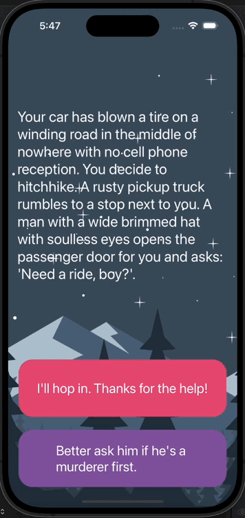

#  Destini



## Goal

Destini is an immersive "choose your own adventure" game meticulously crafted using the Model-View-Controller (MVC) architectural pattern. Inspired by popular narrative-driven apps like "Life Line," Destini offers users a dynamic and interactive storytelling experience where the narrative unfolds based on the choices made by the player. Key features of the app include:

## Dynamic Narrative
The app presents users with a captivating narrative that dynamically evolves based on the decisions they make throughout the game. Each decision leads to branching storylines, offering a unique and personalized experience with every playthrough.

## Interactive Decision-Making 
At various points in the story, users are presented with two options to choose from, each affecting the direction of the narrative. These decision points drive the plot forward, allowing users to shape the outcome of the story through their choices.

## Flexible Design for Expansion 
Destini is designed with flexibility in mind, allowing for continuous refinement and expansion of the storyline and gameplay elements. New story arcs, characters, and decision points can be seamlessly integrated to keep the experience fresh and engaging for users over time.


## Story Strings
```
        Story(
            title: "Your car has blown a tire on a winding road in the middle of nowhere with no cell phone reception. You decide to hitchhike. A rusty pickup truck rumbles to a stop next to you. A man with a wide brimmed hat with soulless eyes opens the passenger door for you and asks: 'Need a ride, boy?'.",
            choice1: "I'll hop in. Thanks for the help!", choice1Destination: 2,
            choice2: "Better ask him if he's a murderer first.", choice2Destination: 1
        ),
        Story(
            title: "He nods slowly, unfazed by the question.",
            choice1: "At least he's honest. I'll climb in.", choice1Destination: 2,
            choice2: "Wait, I know how to change a tire.", choice2Destination: 3
        ),
        Story(
            title: "As you begin to drive, the stranger starts talking about his relationship with his mother. He gets angrier and angrier by the minute. He asks you to open the glovebox. Inside you find a bloody knife, two severed fingers, and a cassette tape of Elton John. He reaches for the glove box.",
            choice1: "I love Elton John! Hand him the cassette tape.", choice1Destination: 5,
            choice2: "It's him or me! You take the knife and stab him.", choice2Destination: 4
        ),
        Story(
            title: "What? Such a cop out! Did you know traffic accidents are the second leading cause of accidental death for most adult age groups?",
            choice1: "The", choice1Destination: 0,
            choice2: "End", choice2Destination: 0
        ),
        Story(
            title: "As you smash through the guardrail and careen towards the jagged rocks below you reflect on the dubious wisdom of stabbing someone while they are driving a car you are in.",
            choice1: "The", choice1Destination: 0,
            choice2: "End", choice2Destination: 0
        ),
        Story(
            title: "You bond with the murderer while crooning verses of 'Can you feel the love tonight'. He drops you off at the next town. Before you go he asks you if you know any good places to dump bodies. You reply: 'Try the pier.'",
            choice1: "The", choice1Destination: 0,
            choice2: "End", choice2Destination: 0
        )      
```
